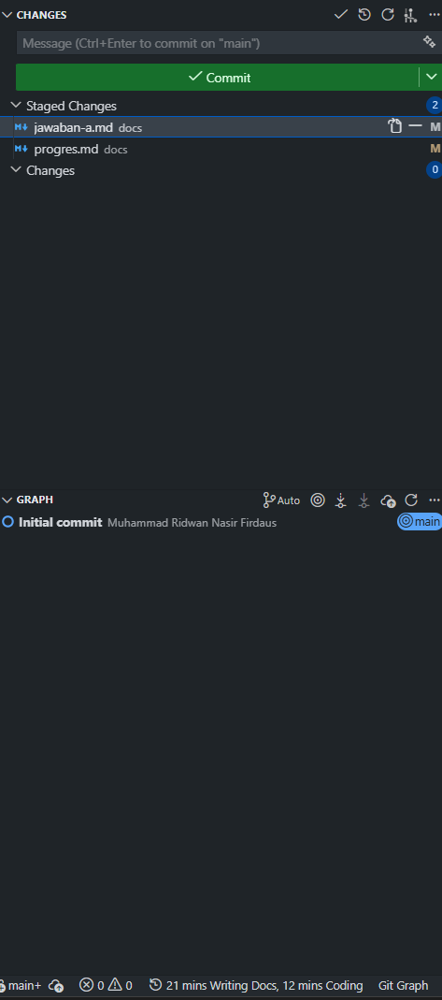
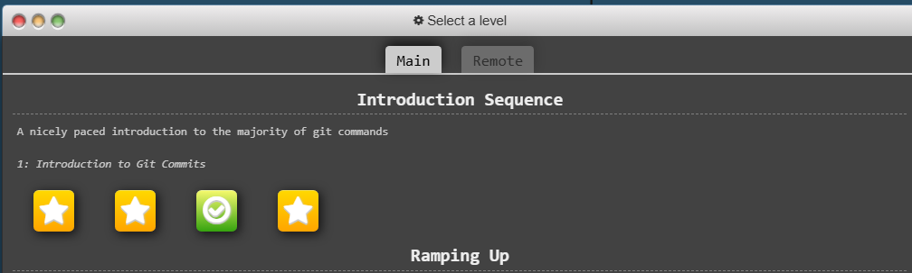
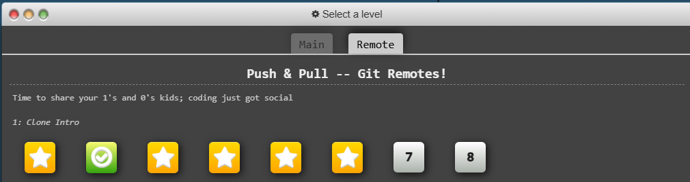
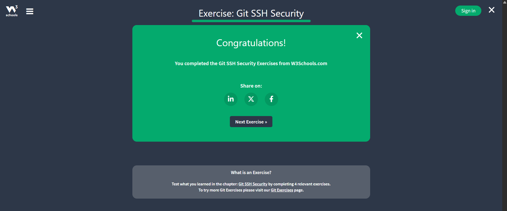
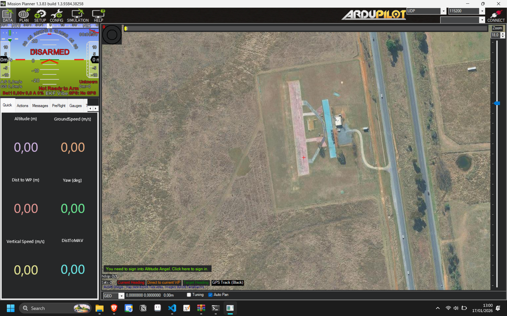

## Solusi Soal A

### 1. **Analisis Kondisi**
my email gweh : _blom ngisi tehe_

### 2. **Source Control Management**
* a. Commands dalam git: 
    * `git init` \
    Menginisiasi git repository\
    **Contoh**: `git init .`
    * `git add`\
    Memindahkan perubahan pada _working directory_ ke _staging area_\ 
     **Contoh**: `git add <filename>`
    * `git commit`\
    Menyimpan perubahan yang ada pada project ke _local git repository history_\
    **Contoh**: `git commit -m "Commit Message"` 
    * `git push` \
    Meng-_upload_ perubahan pada _local repository_ ke _remote repository_ \
    **Contoh**: `git push`
    * [**Referensi Git Commands**](https://git-scm.com/docs/git#_git_commands) 
     
* b. Integrate git dan vscode dengan github
     
 
     
    
* c. Min aku beneran udah kerjain kok...\
    **Reaksi atmin**:
     
     
     

    **Gweh bilek**: Ini buktinya ✋😛🤚 
     
     
     
     
     

* d.Git SSH 
     
     

### 3. **Pengenalan Ground Control Station**
* a. Tangkapan layar utama _Mission Planer_
     
    
     
* b. Main features Mission Planner:
    * **PLAN**\
    Fitur pembuatan mission, fence, dan rally point. \
    **Mission** berfungsi membuat perencanaan dan eksekusi rencana penerbangan UAV, lalu **fence** adalah pembuatan area digital yang mana dapat membatasi area penerbangan UAV. Dan **rally point** berfungsi sebagai area darurat untuk UAV mendarat (copter) atau loiter (plane) ketika tidak dimungkinkannya dilakukan RTL (Return to Launch) mode. 
    * **DATA**\
    Menampilkan informasi visual dari vehicle.\
    Kegunaannya memungkinkan pemantauan data teletri dari UAV ketika sedang beroperasi.
    * **SETUP**\
    Melakukan pengaturan UAV.\
    Kegunaannya untuk mengatur konfigurasi (seperti kalibrasi Accel, kalibrasi Radio, Failsafe plan) dari UAV sebelum siap dioperasikan.
    * **SIMULATION**\
    Menjalankan SITL (Software in The Loop).\
    Kegunaannya memungkinkan pengoperasian UAV secara virtual.
* c. [Waypoint mission](../src/a/3/mission.waypoints)

### 4. **Development Environment**

