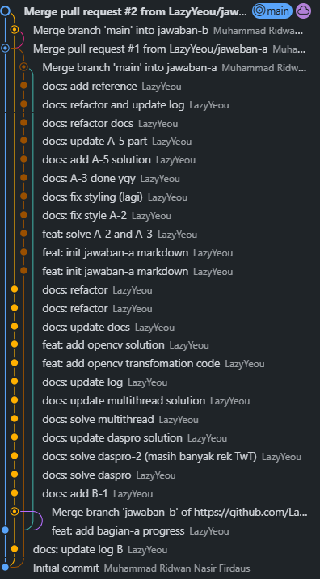
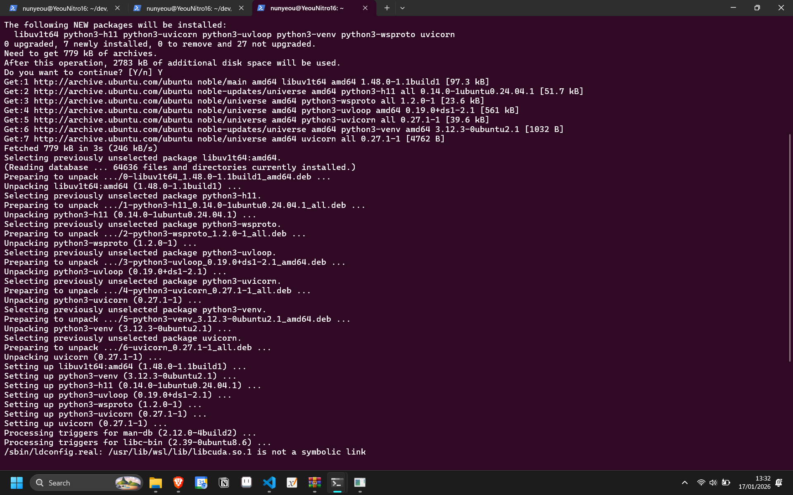
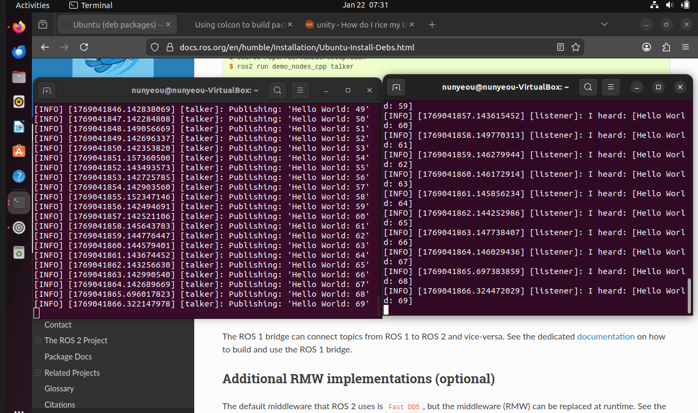
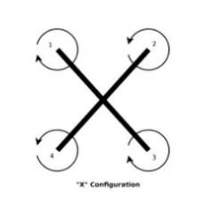
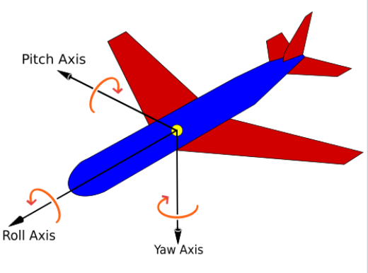
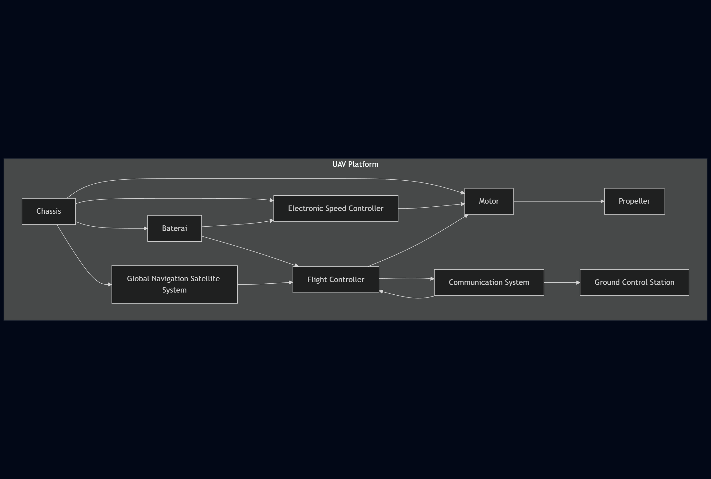

## Solusi Soal A

### Ridu | 19625123 

---

### 1. **Analisis Kondisi**
**Email**: ridu2504@gmail.com

---

### 2. **Source Control Management**

#### a. **Commands dalam Git**
- **`git init`**  
  Menginisiasi git repository  
  **Contoh:** `git init .`

- **`git add`**  
  Memindahkan perubahan pada _working directory_ ke _staging area_  
  **Contoh:** `git add <filename>`

- **`git commit`**  
  Menyimpan perubahan yang ada pada project ke _local git repository history_  
  **Contoh:** `git commit -m "Commit Message"`

- **`git push`**  
  Meng-upload perubahan dari _local repository_ ke _remote repository_  
  **Contoh:** `git push`

#### b. **Integrasi Git dan VSCode dengan GitHub**

 
  
 

#### c. **Git**
 
  
 
  
 

#### d. **Git SSH**

 
  
 

#### e. **Branching**

 
  
 

---

### 3. **Pengenalan Ground Control Station**

#### a. **Tangkapan Layar Utama Mission Planner**

 
  
 

#### b. **Fitur Utama Mission Planner**

- **PLAN**  
  Fitur untuk membuat mission, fence, dan rally point.  
  **Mission** berfungsi untuk merencanakan dan mengeksekusi penerbangan UAV. **Fence** adalah pembuatan area pembatas untuk penerbangan UAV, sedangkan **Rally Point** adalah area darurat tempat UAV mendarat atau loiter ketika mode RTL (Return to Launch) tidak memungkinkan.

- **DATA**  
  Menampilkan informasi visual dari vehicle.  
  Memungkinkan pemantauan data telemetri UAV saat beroperasi.

- **SETUP**  
  Pengaturan UAV, termasuk kalibrasi Accel, kalibrasi Radio, dan Failsafe plan sebelum operasional.

- **SIMULATION**  
  Menjalankan SITL (Software in The Loop) untuk operasi UAV secara virtual.

#### c. **[Waypoint Mission](../src/a/3/mission.waypoints)**  

---

### 4. **Development Environment**

#### a. **Tangkapan Layar Instalasi Library**
(Menggunakan VM karena kesalahan instalasi OS pada WSL)

 
  
 

#### b. **System Talk-Listener**
 
  
 

---

### 5. **Dasar-Dasar UAV**

#### a. **Klasifikasi UAV**

1. **VTOL / Rotary-Wing**  
    UAV jenis ini menggunakan baling-baling (rotor) sebagai penghasil gaya angkat. Rotor yang saling diagonal memiliki arah rotasi yang sama.

     
    
   Dapat dilihat pada gambar diatas, rotor 1 dan 3 memiliki arah rotasi yang sama yaitu searah dengan jaram jam, sedangkan rotor 2 dan 4 berotasi tidak searah dengan jaram jam. Perbedaan arah rotasi ini menghasilkan total gaya dorong yang sama sehingga membuat UAV dapat terbang secara stabil. Lalu agar UAV dapat bergerak serta berotasi, gyroscope dan control unit pada UAV akan menentukan motor mana yang rotasinya ditingkatkan dan diturunkan tergantung input yang diberi dari pilot. Gambar dibawah ini merupakan contoh input dan gerak yang dihasilkan.
   
     
    

2. **HTOL / Fixed-Wing**  
   UAV jenis ini memerlukan landasan untuk takeoff ataupun landing. Terdapat 4 gaya utama pada UAV ini, yaitu gaya angkat (lift), gaya berat, gaya hambat (drag), dan gaya dorong (thrust). Gaya angkat pada UAV ini disebabkan adanya perbedaan tekanan udara antara bagian atas dan bawah sayap (Kutta-Joukowski Theorem). Keunggulannya yaitu menggunakan lebih sedikit energi, lebih hemat, dan memiliki waktu terbang lebih lama dibanding UAV jenis VTOL.

3. **Hybrid**  
   UAV jenis ini menggabungkan konsep fixed dan rotary-wing. Konsep rotary-wing digunakan untuk menciptakan gaya angkat, lalu setelah berada diudara digunakan konsep fixed-wing. Hal itu membuat UAV jenis ini sangat fleksibel, namun sistemnya cenderung kurang reliable dibanding fixed dan rotary wing, maintenance-nya lebih kompleks, dan massanya yang tinggi karena memiliki lebih banyak komponen.

#### b. **Gerakan Roll, Pitch, dan Yaw**
- **Pitch**: Gerak rotasi terhadap sumbu Y (misalnya, hidung pesawat bergerak naik atau turun).  
- **Yaw**: Gerak rotasi terhadap sumbu Z.  
- **Roll**: Gerak rotasi terhadap sumbu X.

 
  
 

**Groundspeed** adalah kecepatan pesawat relatif terhadap permukaan bumi, sementara **Airspeed** adalah kecepatan relatif terhadap udara. Groundspeed merupakan penjumlahan dari airspeed dan kecepatan angin.

**HDOP** (Horizontal Dilution of Precision) digunakan untuk mengukur akurasi **GPS** (Global Positioning System), dan **RSSI** (Received Signal Strength Indicator) adalah indikator yang digunakan untuk mengukur daya/kekuatan dari sinyal radio yang diterima oleh device.

#### c. **Komponen dalam UAV**

- **Chassis**: Kerangka utama yang mendukung semua komponen lainnya seperti sensor, sistem penerbangan, dan motor. Biasanya terbuat dari bahan ringan seperti karbon atau duralumin agar UAV tetap stabil.
- **Motor dan Propeller**: Motor menggerakkan propeller untuk menghasilkan daya angkat dan dorong, memungkinkan UAV terbang.
- **Electronic Speed Controller (ESC)**: Mengatur kecepatan dan arah putaran motor brushless.
- **Baterai**: Menyuplai tenaga untuk motor, sensor, dan sistem kontrol UAV.
- **Flight Controller**: Mengubah perintah input dari pengguna (seperti joystick) menjadi voltase yang dialirkan ke sistem motor UAV.
- **Communication System**: Menggunakan frekuensi radio dua arah, seperti 2.4GHz dan 5GHz, untuk memastikan data dari sensor atau input kontrol dapat dikirim ke operator di darat.
- **Navigation System / GNSS**: Digunakan untuk menentukan posisi UAV di dunia nyata.

Diagram komponen:

 
  
 

#### d. **Paper UAV**
**The Survey of Evolutionary Deep Learning-Based UAV Intelligent Power Inspection**  
Paper ini membahas penerapan **Evolutionary Deep Learning (EDL)** dalam sistem power inspection berbasis UAV dan fokus pada deteksi objek di lingkungan yang menantang. EDL dapat meningkatkan performa dengan mengotomatisasi optimasi arsitektur jaringan dan hiperparameter. Tantangan utama yang dihadapi dalam power inspection UAV berbasis **Deep Learning konvensional** adalah deteksi objek kecil, penanganan latar belakang yang kompleks, serta keseimbangan antara kinerja real-time dengan keterbatasan sumber daya komputasi. EDL dan **Evolutionary Computation (EC)** menawarkan solusi untuk mengatasi tantangan tersebut.  

---

### 6. **Algoritma**

### a. Algoritma A* dan D*

#### Algoritma A*

A* adalah algoritma pencarian berbasis best-first search yang mempertimbangkan baik cost untuk mencapai node dari node awal (g(n)) maupun perkiraan cost dari node tersebut ke tujuan (h(n)). Algoritma ini menggunakan dua himpunan, yaitu open set dan closed set, untuk mengeksplorasi graf.

- **Open Set**: Berisi node yang akan dievaluasi. Pada awalnya, hanya berisi node awal.
- **Closed Set**: Berisi node yang sudah dievaluasi.

Algoritma ini secara berulang memilih node dalam open set dengan nilai f-score terkecil, mengevaluasi node tersebut, lalu menambahkannya ke dalam closed set. Kemudian, node tersebut diperluas dengan mempertimbangkan tetangga-tetangganya dan menghitung f-score mreka.

#### **Menghitung f-score**

F-score untuk sebuah node n dihitung dengan rumus sebagai berikut:

$$f(n) = g(n) + h(n)$$

- **g(n)** adalah cost jalur dari node awal ke node n.
- **h(n)** adalah perkiraan cost dari node n ke tujuan.

#### Algoritma D*

 Kekuatan inti algoritma D* terletak pada kemampuan perencanaan jalur dinamisnya, yang memungkinkannya untuk menyesuaikan jalur berdasarkan perubahan lingkungan secara real-time Algoritma D\* beroperasi secara iteratif, memperbarui jalur ke tujuan secara terus-menerus dengan mempertimbangkan perubahan di lingkungan, seperti **rintangan dinamis** atau modifikasi medan. Kemampuan untuk beradaptasi secara real-time menjadikannya aset berharga untuk navigasi UAV otonom, di mana responsivitas terhadap kondisi yang berkembang sangat penting. 

#### Keunggulan D*

Jika dibandingkan dengan metode navigasi lain yang banyak digunakan dalam UAV, sepert, algoritma A*, Machine Learning dan Deep Learning, algoritma D\* menunjukkan keunggulan dalam lingkungan dinamis. D\* memastikan realtime adaptation dan navigasi tanpa tabrakan. Integrasinya dengan sistem persepsi seperti LiDAR dan kamera semakin meningkatkan efektivitasnya.
 
### b. PID
PID adalah singkatan dari **Proportional-Integral-Derivative** yang merujuk pada algoritma pengendalian yang sering digunakan dalam sistem kontrol otomatis. PID digunakan untuk menjaga nilai output dari sistem tetap pada titik yang diinginkan (setpoint) dengan cara mengatur input ke sistem berdasarkan kesalahan (error) yang ada.

PID mengkombinasikan tiga komponen utama:
1. **Proportional (P)**: Bagian ini mengontrol besarnya respons berdasar besarnya kesalahan. Semakin besar kesalahan, semakin besar respons yang diberikan dan viceversa. 
2. **Integral (I)**: Bagian ini mengatasi kesalahan yang bersifat kumulatif atau jangka panjang dengan menjumlahkan kesalahan yang terjadi selama periode waktu tertentu.
3. **Derivative (D)**: Bagian ini merespons perubahan kesalahan seiring waktu, sehingga dapat memperbaiki kestabilan sistem.

### Rumus
Hasil dari PID dapat dihitung dengan rumus sebgai berikut:

$$
u(t) = K_p e(t) + K_i \int_0^t e(\tau) \, d\tau + K_d \frac{d}{dt} e(t)
$$

Di mana:
-  $u(t)$ adalah output kontroler PID pada waktu $t$
-  $e(t)$ adlah kesalahan pada waktu $t$, yaitu selisih antara setpoint dan output aktual sistem
- $K_p$ adalah konstanta proportional yang mengatur besarnya respons proporsional terhadap kesalahan
- $K_i$ adalah konstanta integral yng mengatur pengaruh kesalahan kumulatif
- $K_d$ adalah konstanta derivative yang mengatur pengaruh perubahan kesalahan terhadap output

### c. Kalman Filter dan Extendedn Kalman Filter

### **Kalman Filter (KF)**

**Kalman Filter** adalah algoritma yang digunakan untuk memperkirakan keadaan suatu sistem dinamis berdasarkan pengukuran yang mengandung noise. 

Kalman Filter bekerja dengan dua langkah utama:

1. **Prediksi:** Memperkirakan status sistem saat ini berdasarkan model dinamis dan estimasi keadaan sebelumnya.
2. **Pembaruan:** Mengoreksi prediksi berdasarkan pengukuran yang diterima, dengan mempertimbangkan ketidakpastian pengukuran.

Persamaan:

* **Prediksi keadaan:**  
  
  $\hat{x}_k = A \hat{x}_{k-1} + B u_k$
  
  - $\hat{x}_k$ : estimasi keadaan pada waktu \(k\),
  - $A$ : matriks transisi keadaan,
  - $B$ : matriks kontrol,
  - $u_k$ : input kontrol.

* **Pembaruan pengukuran:**  

  $\hat{x}_k = \hat{x}_k + K (z_k - H \hat{x}_k)$

  Di mana:
  - $z_k$ : pengukuran yang diterima,
  - $H$ : matriks observasi,
  - $K$ : matriks gainm, mengontrol seberapa besar koreksi yang harus diterapkan.

### **Extended Kalman Filter (EKF)**

**Extended Kalman Filter (EKF)** adalah imporovemnt dari kalman filter yang digunakan untuk mengatasi ketidaklinieran dalam model sistem atau pengukuran. Algortima EKF mengatasi masalah ini dengan meng-linearisasikan fungsi sistem dan pengukuran pada titik tertentu.

### Aplikasi
- Kalman Filter digunakan dalam aplikasi seperti navigasi GPS, sistem kendali pesawat, dan pemrosesan sinyal.
- EKF banyak digunakan dalam aplikasi yang melibatkan sistem non-linier, misal robotika, sistem otonom, dan image precessing.

---

### Referensi:

#### Git

* [Git Commands](https://git-scm.com/docs/git#_git_commands)

#### UAV dan GCS

* [Mission Planner Features](https://ardupilot.org/planner/docs/mission-planner-features.html)
* [UNMANNED AERIAL VEHICLES: FUNDAMENTALS, COMPONENTS, MECHANICS, AND REGULATIONS](https://novapublishers.com/wp-content/uploads/2020/10/Unmanned-Aerial-Vehicles.pdf)
* [Motion basics: How to define roll, pitch, and yaw for linear systems](https://www.linearmotiontips.com/motion-basics-how-to-define-roll-pitch-and-yaw-for-linear-systems/)
* [Drone VTOL vs HTOL](https://training.terra-drone.co.id/drone-vtol-vs-drone-htol/)
* [What is RSSI? Understanding Your RSSI Level](https://www.virginmedia.com/the-edit/glossary/what-is-rssi)
* [What is HDOP?](https://novotech.com/pages/horizontal-dilution-of-precision-hdop)

#### Paper

* [The Survey of Evolutionary Deep Learning-Based UAV Intelligent Power Inspection](https://www.mdpi.com/2504-446X/10/1/55)

#### Algoritma

* [A* Search Algorithm](https://www.geeksforgeeks.org/dsa/a-search-algorithm/)
* [The A* Algorithm Explained](https://medium.com/@kattilaxman4/the-a-algorithm-explained-9cdbce1c8f3c)
* [D* Algorithm](https://www.mdpi.com/2071-1050/16/17/7867)
* [Introductory Chapter: PID-Based Industrial Process Control](https://doi.org/10.5772/intechopen.109036)
* [Proportional Integral Derivative (PID)](https://apmonitor.com/pdc/index.php/Main/ProportionalIntegralDerivative)
* [Kalman Filter](https://kalmanfilter.net/)
* [Extended Kalman Filter (EKF)](https://ardupilot.org/copter/docs/common-apm-navigation-extended-kalman-filter-overview.html)
* [Extended Kalman Filter](https://www.sciencedirect.com/topics/computer-science/extended-kalman-filter)