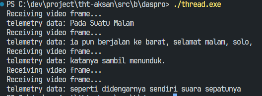
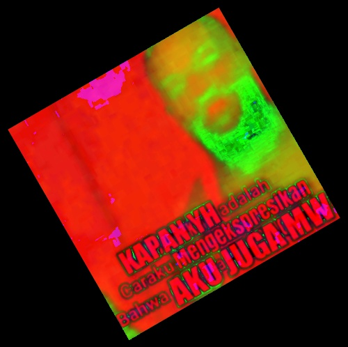

## Solusi Bagian B
### Ridu | 19625123

### DASPRO
1.  **OOP**
    1. * **Class** dalam OOP bertindak sebagai blueprint dari sebuah objek. Dengan adanya class kita dapat membuat objek dengan sifat yang sama dalam jumlah banyak.

        ```cpp
         //Class untuk hewan anjing
         class Cat {
             //property
             std::string name;

             //method
             void meow() {
                 std::cout << "miawww :3" << std::endl;
             }
         };
        ```

        * **Objek** adalah bentuk nyata dari **class**

         ```cpp
        class Cat {
        private:
                std::string name;

        public:
                //constructor
                Cat(std::string name){
                    this->name = name; 
                }

                //setter nama
                std::string getName() {
                    return name;
                }

                void meow() {
                    std::cout << "miawww :3" << std::endl;
                }
                };

        int main() {
            //objek dari class Cat dengan nama cat1
            Cat cat1("si imoet");
            std::cout << cat1.getName() << std::endl;
            cat1.meow();
        }
        ```

        * **Abstraction** adalah konsep menghilangkan proses yang rumit dan hanya menampilkan   fitur esensial / inti. Aplikasinya dalam c++ adalah berupa abstract classes

        ```cpp
        class Kendaraan {
        public: 
            //virtual pure function
            virtual void horn() = 0;
        };

        class mobil : public Kendaraan {
        public: 
            //definisi ulang fungsi dari abstract class
            void horn() override {
                std::cout << "BIP BIP" << std::endl;
            } 
        };
        ```

        * **Encapsulation** merupakan proses membungkus data dan method kedalam sebuah unit     biasanya berupa class untuk mencegah data diakses dari luar unit tersebut.

        ```cpp
        class Kendaraan {
        private:
            string jenis;
        public:
            void setJenis(string jenis) {
                this->jenis = jenis;
            }

            void getJenis() {
                return jenis;
            }
        };
        ```

        * **Inheritance** merupakan konsep penurunan data dan method dari kelas satu kelas ke   kelas lainnya. Dalam terminologinya kelas yang menurunkan fiturnya disebut parent class atau superclass dan class yang mewarisi fitur disebut children class atau subclass. 

        ```cpp
        //parent class
        class Hewan {
        public:
            void eat() {
                std::cout<< "NOM NOM" << std::endl;
            }
        };

        //child class
        class Kucing : public Hewan {
        public:
            void suara() {
                std::cout << "MIAW :3" << std::endl;
            }
        };
        ```

        * **Polymorphism** merupakan konsep dimana sebuah fungsi dapat memiliki behaviour yang berbeda tergantung dengan objek yang menerimannya.
        
        ```cpp 
        class Kendaraan {
        public: 
            //virtual pure function
            virtual void horn() = 0;
        };

        class Mobil : public Kendaraan {
        public: 
            //definisi ulang fungsi untuk class Mobil
            void horn() override {
                std::cout << "BIP BIP" << std::endl;
            } 
        };
        class Motor : public Kendaraan {
        public: 
            //definisi ulang fungsi untuk class Motor
            void horn() override {
                std::cout << "TIN TIN" << std::endl;
            } 
        };
        ```
    2. NULL
2.  1. `#include` merupakan *preprocessor directive* atau perintah kepada *preprocessor* untuk menyalin file lain ke dalam *source code* sebelum di-*compile*. Ketika menggunakan `#include <filename>` compiler mencari file di standard library atau library bawaan c++, seperti `<iostream>`, `<string>`, `vector`, dll. Sedangkan `#include "filename"` compiler mencari file di dalam direktori projek saat ini. Jika tidak ditemukan maka pencarian akan dilakukan di directory standard library. Biasa digunakan untuk memanggil customized header (header yang dibuat sendiri), seperti `myHeader.h`.
    1. `#ifdef` merupakan directives yang mengizinkan kompilasi kode yang ada dalam blok jika macro yang digunakan sebagai parameter telah di-define dan `#endif` berfungsi sebagai penutup blok. 
    ```cpp
        #ifdef PI
            std::cout << "Macro PI sudah di define" << std::endl;
        #endif
    ```
    `#ifndef` merupakan kebalikan dari `#ifdef`, directive ini berfungsi untuk mengecek apakah macro yang digunakan sebagai parameter telah di-define atau belum. Jika belum di-define maka kode yang ada dalam blok akan dijalankan.
    ```cpp
        #ifndef PI
            std::cout << "Macro PI blum di define" << std::endl;
        #endif
    ```
    `#pragma once` adalah directive yang berfungsi untuk menentukan bahwa file header hanya akan diproses sekali saat proses compilation. \
    2.  `namespace` digunakan untuk pengelompokkan kode (variable, fungsi, class) agar tidak terjadi collision pada penamaan. Jika diibaratkan ini seperti folder, jika kita punya file test.jpg dalam folder A dan B komputer tidak akan bingung untuk mengakses keduanya karena memiliki path yang berbeda. `::` adalah Scope Resolution Operator, digunakan mengakses isi dari namespace tersebut.
    ```cpp
        namespace FirstFoo {
            void call() {}
        }

        namespace SecondFoo {
            void call() {}
        }

        int main(){
            FirstFoo::call();
            SecondFoo::call();

            return 0;
        }
    ``` 
    3. Beda dari `#define` dengan `using`, pada directive `#define` compiler akan mengganti macro yang didefinisika, hal ini dapat memicu error karena tidak ada pengeceka tipe data. Sedangkan `using` digunakan untuk mendefinisika typedef alias. Jika menggunakan `#define` contohnya seperti kode berikut:
    ```cpp
    #define LL long long

    void func1(LL value); //aman
    void func2(char LL); //error rek, compiler ngeliatnya void func2(char long long)
    
    ``` 
    Ketika menggunakan `using`:
    ```cpp
    using LL long long;

    void func1(LL value); //aman, compiler ngebaca func1(long long value)
    void func2(char LL); //aman juga, compiler ngebaca sebagai func2(char LL)
    ```
    4. **Address** merupakan alamat memori yang ditempati oleh sebuah variabel, dan **pointer** adalah variable yang menyimpan alamat memori. Berikut adalah contoh penggunaannya:
    ```cpp
    int x = 10; //misal alamat dari x adalah 0x7ff7
    int *ptr = &x //ptr adalah pointer yang menyimpan alamat dari variabel x
    ``` 
    5. Pass by value merupakan proses ketika sebuah argumen dimasukkan ke dalam fungsi tetapi argumen yang diteruskan bukanlah nilai asli tapi merupakan salinan. Contoh sebagai berikut:
    ```cpp
        int main(){
            void modif(int x) {
                x += 10;
            }
        int x = 10; 
        modify(x) //fungsi pass by value
        std::cout << x << std::endl; //nilai x tetap 10
        }
    ``` 
    **Pass by reference** sendiri adlaah proses ketika argumen dimasukkan ke dalam fungsi dan argumen yang diproses merupakan alamat memori sebuah variabel.
    ```cpp
        int main(){
            void modif(int &x) {
                x += 10;
            }
        int x = 10; 
        modify(x) //fungsi pass by refernce
        std::cout << x << std::endl; //nilai x berubah menjadi 20 
        }
    ``` 
    6. **Unique pointer** merupakan smart pointer yang digunakan untuk mengelola kepimilikan ekskludif atas satu objek (hanya ada satu **unique pointer** yang dapat memiliki objeck dalam satu waktu). Berikut contoh aplikasinya:
    ```cpp
    #include <iostream>
    #include <memory> 

    class MyClass {
    public:
        MyClass() { std::cout << "MyClass constructed\n"; }
        ~MyClass() { std::cout << "MyClass destructed\n"; }
    };

    int main() {
        std::unique_ptr<MyClass> ptr1 = std::make_unique<MyClass>();  // unique_ptr
        // std::unique_ptr<MyClass> ptr2 = ptr1; // error: tidak bisa menyalin unique_ptr
        std::unique_ptr<MyClass> ptr2 = std::move(ptr1);  // memindahkan kepemilikan
        return 0;
    }
    ```

    **Shared pointer** adlaah smart pointer yang memungkinkan lebih dari satu pointer memiliki objek yang sama. Objek akan tetap ada selama ada satu pointer yang mengarah kepadanya, jika tidak objek akan dihancurkan. Contoh aplikasi:
    ```cpp
    #include <iostream>
    #include <memory> 

    class MyClass {
    public:
        MyClass() { std::cout << "MyClass constructed\n"; }
        ~MyClass() { std::cout << "MyClass destructed\n"; }
    };

    int main() {
        std::shared_ptr<MyClass> ptr1 = std::make_shared<MyClass>();  // membuat shared_ptr
        {
            std::shared_ptr<MyClass> ptr2 = ptr1;  // ptr2 berbagi kepemilikan dengan ptr1
            std::cout << "Inside inner scope\n";
        }  // ptr2 keluar dari scope tapi ptr1 tetap ada, objek masih ada

        std::cout << "Back to main scope\n";
        return 0;
    }
    ```
  

3. **Multithreading**
    1. **Multitreading** adalah Kemampuan program untuk menjalankan bagian kode(thread) secara bersamaan atau paralel. Dalam multithreading terdapat beberapa konsep, yaitu:
        * **Thread**: Unit terkecil yang dieksekusi oleh program
        * **Deadlock**: Keadaan ketika dua thread aau lebih saling menunggu untuk melepas shared resource yang thread lain pegang.
        * **Race condition**: Kondisi ketika dua thread atau lebih mengakses resource yang sama, karena thread saling berlomba untuk membaca dan mengubah data maka hasil akhir dari shared data akan tak terprediksi.
        * **Starvation**: Kondisi ketika suatu thread tidak dapat mengakses shared resource karena thread lain mendapat prioritas lebih.
    2. [Source Code](../src/b/daspro/thread.cpp) \
    Lampiran Output: \
       

---

### Jurusan Control and Perception (ConCept)
1. ... 
2. ... 
3. ...
4. ...
5. **Transformasi image dengan OpenCV C++** \
    Image sebelum transformasi:

     
    <br>

    Image setelah transformasi: 

     
    <br>

    [Source Code Transformasi Image](../src/b/concept/b-5/display_image.cpp)
6. Tracking Object \
   [Source Code Tracking Object](../src/b/concept/b-6/circle.cpp) \
   [Output Video Tracking](../src/b/concept/b-6/output.avi) 

### Referensi

#### Daspro
* [Preprocessor and preprocessor directives](https://www.geeksforgeeks.org/cpp/cpp-preprocessors-and-directives/)
* [Preprocessor directives](https://cplusplus.com/doc/tutorial/preprocessor/)
* [Preprocessor](https://learn.microsoft.com/id-id/cpp/preprocessor/once?view=msvc-170)
* [#Define vs using](https://stackoverflow.com/questions/75367096/is-there-a-difference-between-using-and-define-when-declaring-a-type-alias)
* [auto_ptr vs unique_ptr vs shared_ptr vs weak_ptr in C++](https://www.geeksforgeeks.org/cpp/auto_ptr-unique_ptr-shared_ptr-weak_ptr-in-cpp/)
* [Multithread in cpp](https://www.geeksforgeeks.org/cpp/multithreading-in-cpp/)
* [Multithread reference](https://cplusplus.com/reference/multithreading/)
* [OOP in C++](https://www.geeksforgeeks.org/cpp/object-oriented-programming-in-cpp/) 
* [C++ reference](https://en.cppreference.com/w/cpp.html)

#### Concept
* [OpenCV 4.12 Docs](https://docs.opencv.org/4.12.0/)

